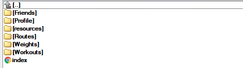
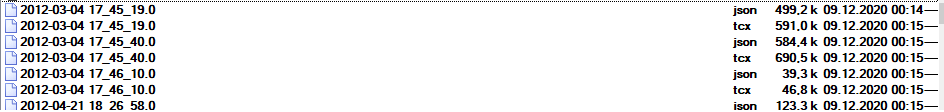
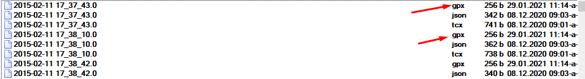
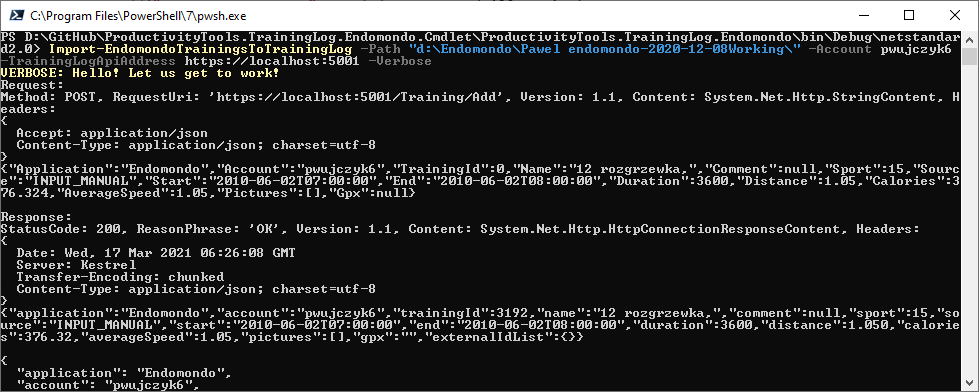

<!--Category:Powershell--> 
 <p align="right">
    <a href="https://www.powershellgallery.com/packages/ProductivityTools.ConvertTcx2Gpx/"></a>
    <a href="http://productivitytools.tech/import-modulesfromdirectory/"><a> 
    <a href="https://github.com/pwujczyk/ProductivityTools.ConvertTcx2Gpx"></a>
</p>
<p align="center">
    <a href="http://productivitytools.tech/">
        
    </a>
</p>


# TrainingLog Endomondo Cmdlet

Module takes Endomondo backup and push it to TrainingLog API.
<!--more-->

It was possible to download Endomondo backup in the format presented below.

<!--og-image-->


In the trainings we can find the 
- json file - metadata of the training 
- tcx - training track



Training log doesn't allow to import TCX data but GPX data. So to start using this cmdlet you need to do a conversion. To make it simple I wrote [ConvertTcxToGpx](https://github.com/pwujczyk/ProductivityTools.ConvertTcx2Gpx) module. 

After conversion you should have updated **Workouts** directory


## Module

Module exposes only one command

```powershell
Import-EndomondoTrainingsToTrainingLog -Path "d:\Endomondo\Pawel endomondo-2020-12-08Working\" -Account pwujczyk5 -TrainingLogApiAddress https://localhost:5001 -Verbose
```

- Path - should be given path to full Endomondo backup not to Trainings directory


